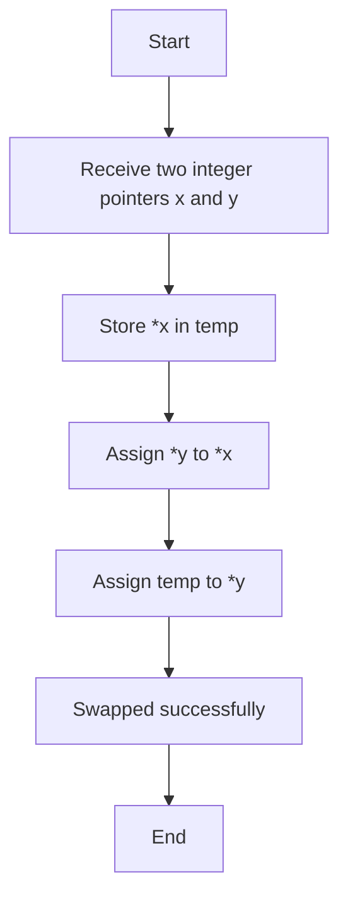
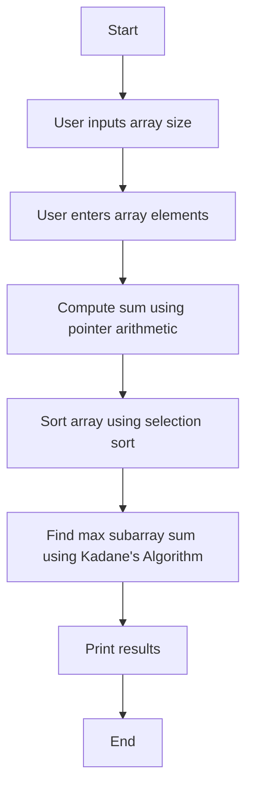
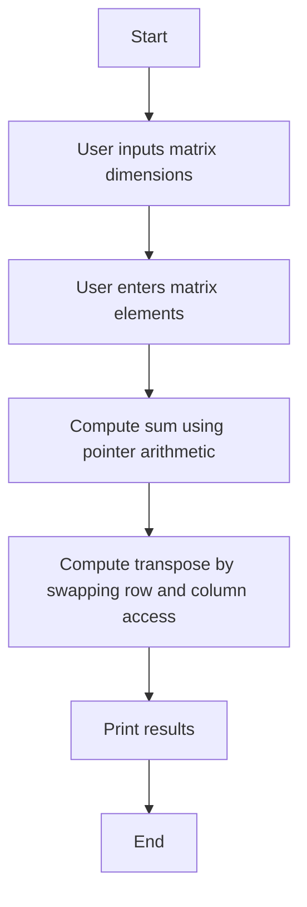

# Assignment Solutions

## Assignment 1: Swap Two Integers Using Pointers

### Algorithm Flow


---

## Assignment 2: 1D Array Operations

### Steps for Sorting and Finding Maximum Subarray Sum


---

## Assignment 3: 2D Array Operations

### Steps for Matrix Sum and Transpose


---

## Assignment 4: Worker Structure Operations

### Sorting Workers by Salary
```mermaid
graph TD;
    A[Start] --> B[User inputs number of workers]
    B --> C[User enters worker details]
    C --> D[Compute total salary using pointer arithmetic]
    D --> E[Sort workers by salary in descending order using selection sort]
    E --> F[Print sorted results]
    F --> G[End]