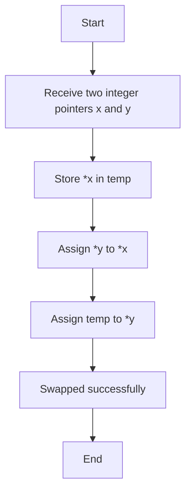
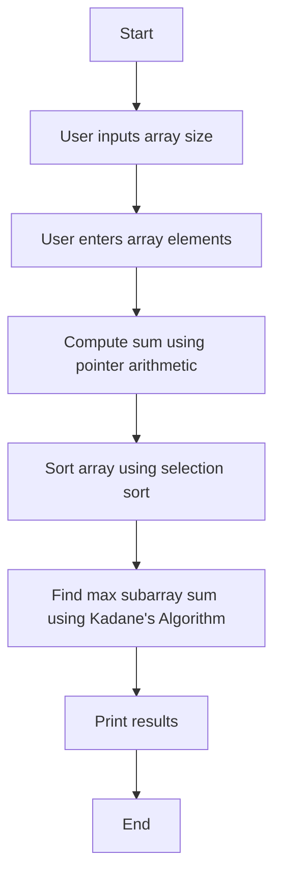
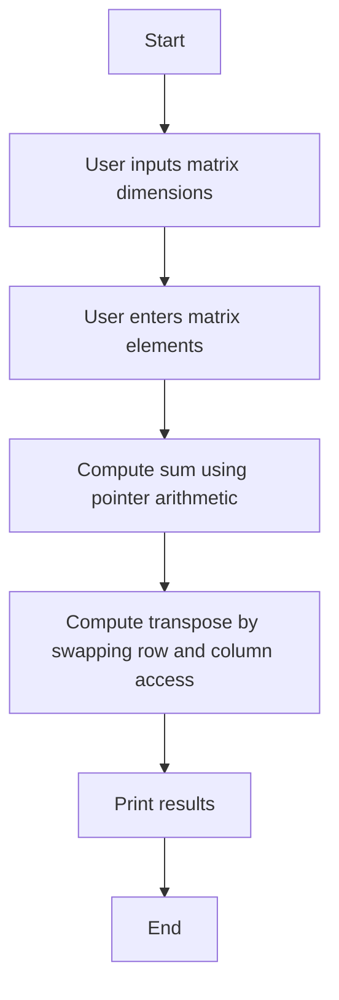
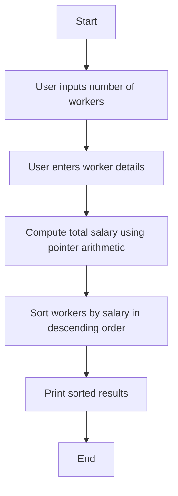

# DSA in C - Solved Assignments

This repository contains solutions for Data Structures and Algorithms (DSA) problems in C, complete with implementations and workflow diagrams.

---

## Assignment 1: Swap Two Integers Using Pointers

### Problem Statement
Write a function to swap two integers using pointers: `void Swap(int* x, int* y)`. Implement a program to test this function.

### Solution
```c
void Swap(int* x, int* y) {
    int temp = *x;
    *x = *y;
    *y = temp;
}
```

### Algorithm Flow


---

## Assignment 2: 1D Array Operations

### Problem Statement
1. Allow user input for a 1D-array.
2. Compute sum using pointers.
3. Sort in ascending order.
4. Find the maximum sum of a subarray.

### Solution
```c
int sumArray(int* arr, int size) { 
    int sum = 0;
    for (int i = 0; i < size; i++) {
        sum += *(arr + i);
    }
    return sum;
}
```

### Algorithm Flow


---

## Assignment 3: 2D Array Operations

### Problem Statement
1. Input a 2D array (matrix).
2. Compute sum using pointers.
3. Print the transpose of the matrix.

### Solution
```c
void transposeMatrix(int** arr, int rows, int cols) {
    for (int j = 0; j < cols; j++) {
        for (int i = 0; i < rows; i++) {
            printf("%d ", *(*(arr + i) + j));
        }
        printf("\n");
    }
}
```

### Algorithm Flow


---

## Assignment 4: Worker Structure Operations

### Problem Statement
1. Input a 1D-array of workers (ID, Name, Age, Salary).
2. Compute total salary using pointers.
3. Sort workers by salary in descending order.

### Solution
```c
typedef struct {
    int id;
    char fullName[50];
    int age;
    float salary;
} Worker;
```

### Algorithm Flow

